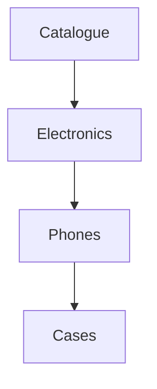

# 🛒 E-Commerce Categories – Full Example



## ✔️ OU used for
- Category trees.
- SEO metadata & display settings.
- Navigation building.

## ❌ OU NOT used for
- Products.
- Prices.
- Stock.
- Orders or baskets.

---

# 🛠 Creating categories

```php
$root = OU::create(['name' => 'Catalogue', 'type' => 'category']);
$electronics = OU::create(['name' => 'Electronics', 'type' => 'category', 'parent_id' => $root->id]);
$phones = OU::create(['name' => 'Phones', 'type' => 'category', 'parent_id' => $electronics->id]);
```

---

# 🧠 Metadata Example

```php
$phones->setMeta('seo_title', 'Latest Smartphones');
$phones->setMeta('menu_icon', 'phone');
$phones->setMeta('display_order', 2);
```

---

# 🧩 Semantic Category Wrapper Example

```php
class Category {
    public static function create(array $attrs) {
        return OU::create(array_merge($attrs, ['type' => 'category']));
    }

    public static function tree() {
        return OU::query()->ofType('category')->root()->first()->buildTree();
    }
}
```
