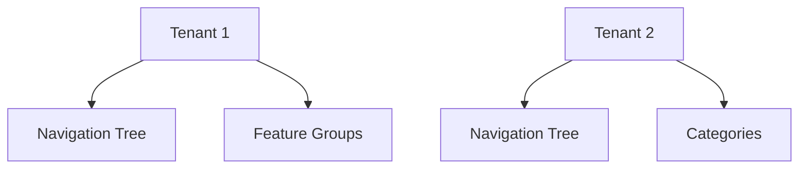

# 🏢 SaaS Multi-Tenant – Full Example



## ✔️ OU used for
- Per-tenant structure.
- Navigation trees.
- Feature modules and groupings.
- Custom per-tenant metadata.

## ❌ Not used for
- Billing.
- Seats/subscriptions.
- Users & permissions.

---

# 🌐 Create a tenant structure

```php
$root = OU::create([
    'tenant_id' => $tenant->id,
    'name' => 'Root',
    'type' => 'tenant_root',
]);
```

Add navigation items:

```php
OU::create(['tenant_id' => $tenantId, 'name' => 'Products', 'type' => 'nav', 'parent_id' => $root->id]);
OU::create(['tenant_id' => $tenantId, 'name' => 'Analytics', 'type' => 'nav', 'parent_id' => $root->id]);
```

---

# 🧠 Metadata Example

```php
$root->setMeta('theme', 'dark');
$root->setMeta('plan', 'pro');
```
