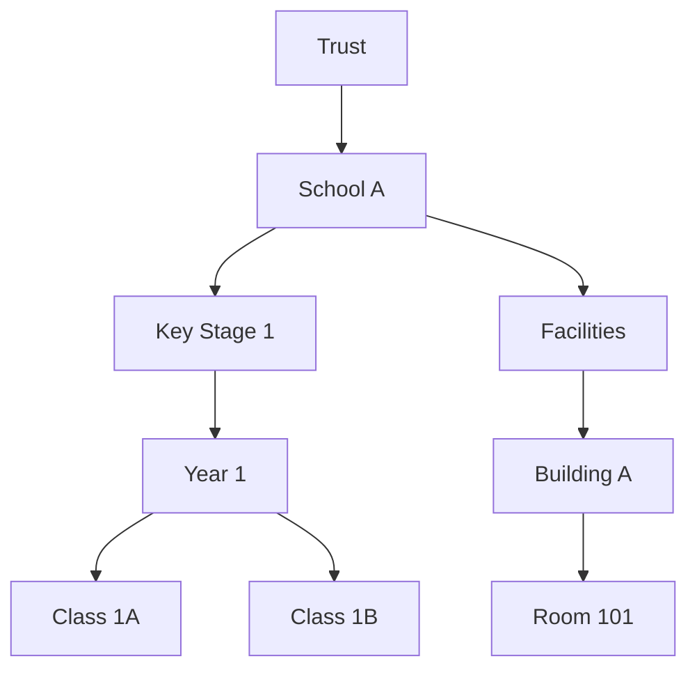

# 🎓 School MIS / SIS – Full Example Using Organisational Units



## ✔️ What the OU *is used for*
- Representing academic structure (Trust → School → KS → Year → Class).
- Representing facilities (Buildings, Rooms).
- Attaching metadata like:
  - `max_class_size`
  - `room_capacity`
  - `is_sen_unit`
- Linking entities such as:
  - Room → TimetableRoom model
  - Class → Teacher model

## ❌ What the OU is *not* used for
- Individual students.
- Behaviour, attendance, grades.
- Timetabling events.
- Assessments or exam records.

---

# 📘 Example: Creating a School Structure

```php
$trust = OU::create(['name' => 'Riverdale MAT', 'type' => 'trust']);

$school = OU::create([
    'name' => 'Riverdale Primary',
    'type' => 'school',
    'parent_id' => $trust->id,
]);

$ks1 = OU::create(['name' => 'Key Stage 1', 'type' => 'key_stage', 'parent_id' => $school->id]);
$year1 = OU::create(['name' => 'Year 1', 'type' => 'year', 'parent_id' => $ks1->id]);

$class1A = OU::create([
    'name' => 'Class 1A',
    'type' => 'class',
    'parent_id' => $year1->id,
]);
```

---

# 🧠 Metadata Example (MIS)

```php
$class1A->setMeta('max_class_size', 30);
$room101->setMeta('capacity', 32);
$school->setMeta('ofsted_rating', 'Good');
```

---

# 🔍 Query Example

Find all classes in the school:

```php
$classes = OU::query()
    ->ofType('class')
    ->whereHas('parent.parent', fn($q) => $q->where('id', $school->id))
    ->get();
```
