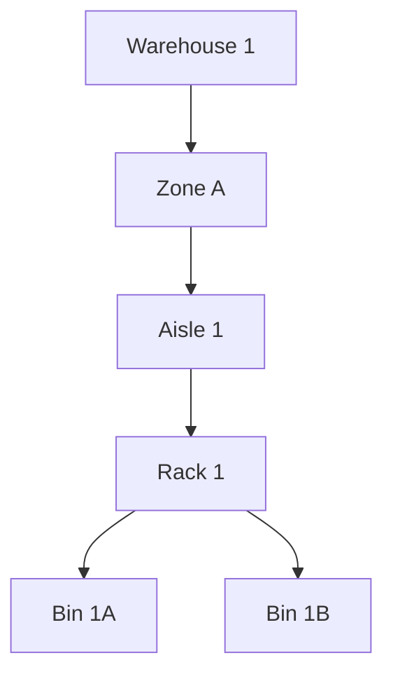

# 📦 Warehouse / WMS – Full Example Using Organisational Units



## ✔️ OU used for
- Warehouse layout structure.
- Representing logical & physical locations.
- Metadata like temperature, load capacity, robots allowed.

## ❌ OU NOT used for
- Inventory quantities.
- Pick/pack operations.
- Stock movement history.
- SKUs or products.

---

# 🛠 Creating Warehouse Structure

```php
$wh = OU::create(['name' => 'Warehouse 1', 'type' => 'warehouse']);

$zoneA = OU::create(['name' => 'Zone A', 'type' => 'zone', 'parent_id' => $wh->id]);

$aisle1 = OU::create(['name' => 'Aisle 1', 'type' => 'aisle', 'parent_id' => $zoneA->id]);

$rack1 = OU::create(['name' => 'Rack 1', 'type' => 'rack', 'parent_id' => $aisle1->id]);

$bin1A = OU::create(['name' => 'Bin 1A', 'type' => 'bin', 'parent_id' => $rack1->id]);
```

---

# 🧊 Metadata Example

```php
$bin1A->setMeta('temperature_zone', 'chilled');
$bin1A->setMeta('max_weight_kg', 200);
$bin1A->setMeta('restricted_items', ['flammable', 'fragile']);
```

---

# 🔍 Query Example

Find all chilled bins:

```php
$chilled = OU::query()
    ->ofType('bin')
    ->get()
    ->filter(fn($bin) => $bin->getMeta('temperature_zone') === 'chilled');
```
